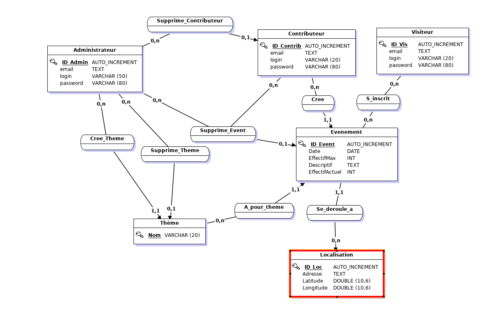

# Todo list:

## Login/Register:
- [x] Refaire le chiffrement des mots de passe

## Général:
- [ ] ~~Gestion de cookies~~
- [x] Refaire le modèle EA (Changer de logiciel)

## event.php:
- [x] afficher plus d'attributs dans la table 
- [ ] ~~mouseover qui affiche la position de l'événement~~
- [x] faire un ordre (ORDER BY) pour les colonnes affichées

## carte.php:
- [ ] tout

## creation.php:
- [x] les options du select
- [x] la gestion des dates(pas compatible IE et passe pas avec mySQL)
- [x] gestion des adresse (longitude latitude)

## contenu.php:
- [x] Système de notation
- [x] Système de commentaires

## profile.php:
- [ ] Faire en sorte que les visiteurs qui postulent pour devenir contributeurs soient mis en attente (-> à valider par un admin)
- [x] Ajouter un bouton pour supprimer les événements crée si l'utilisateur est contributeur

## admin.php:
- [ ] ==afficher les utilisateurs en attente (-> Peut être une colonne dans Visiteur)==

## Modèle E-A actuel:
[//]:   
